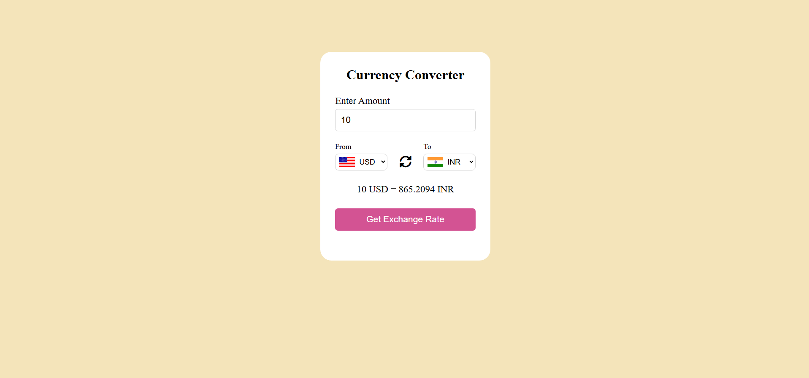

# 💱 Currency Converter Web App

A responsive, modern currency converter that allows users to convert amounts between different currencies using **real-time exchange rates** from the [ExchangeRate API](https://open.er-api.com/). The application features dynamic flag updates, input validation, custom sound effects, and clean UI design.

---

## 📸 Screenshots

---

## 🛠️ Features

- 🔄 **Real-Time Exchange Rates** using `https://open.er-api.com`
- 🎌 **Country Flag Display** beside dropdowns based on selected currency
- 🔉 **Sound Effects**:
  - *Click sound* on conversion.
  - *Change sound* on dropdown update.
- ⚠️ **Input Validation**:
  - Handles empty, invalid, or zero values
  - Shows "Invalid Amount" message without API call or sound
- 🚫 **Hides placeholder flag** until a currency is selected (no empty space)
- ⌨️ **Form submission via Enter key** supported
- ♿ **Accessible and responsive layout**
---

## 🧰 Tech Stack

- **HTML5** — Semantic structure
- **CSS3** — Flexbox layout & responsive design
- **JavaScript (Vanilla)** — DOM manipulation & async API handling
- **ExchangeRate API** — [https://open.er-api.com/](https://open.er-api.com/)
- **Flags API** — Country flags from [https://flagsapi.com](https://flagsapi.com)

---

## 👨‍💻 Author

**Madhav Agrawal**  
- GitHub: [@MadhavAgrawal06](https://github.com/MadhavAgrawal06)

---

## 📄 License

This project is licensed under the [MIT License](./LICENSE).

